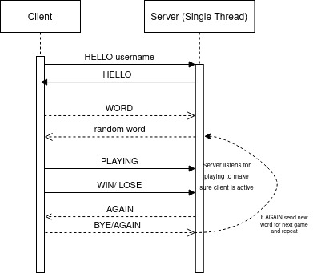

# Wordle
Wordle is a word guessing game. You have 6 attempts and each attempt you make reveals some information.

## Team members and responsibility
Sean Oplinger (Team Leader) - server implementation  
Nafis Conix - library and readme implementation  
Ben Lloyd - client implementation  

## Description

The network application wordle, will allow multiple users to play wordle simultaneously. 
The server will hold the word bank while the client will perform the game processing and user interface.  
The server is a concurrent, connection-oriented server. 
The server accepts one optional command-line argument,  and the port number for the application.  

The client will interact with the user and perform the game functionality.  
The client will accept the server’s hostname and optionally, the port number as a command-line argument.   

There is also a library that was created that contain common functions that will be used by both the client and server. 

## How to compile the client and server
Python has the *luxury* of being intrepted so this step is not necessary. 

## How to run the client and server
The server can be started by typing, the port number is *optional* 
`python server.py <port#>` 
The client can be started by typing, the port number and hostname are *optional* 
`python client.py <port#> <hostname>` 

## Potocol developed and syntax

### Definition
Each message, with the exclusion of random word and username, is represented as a capitalized string with % appended as the delimiter of the message. ie. WORD is represented as "WORD%"

The sequence diagram shows the order of messages sent and recieved from client and server. This process is duplicated on multiple threads for multiple connections to the server.

## Library type
Shared library - the reason for using this type of library is so we only have to load the library code once which will
use less memory space. This also allows for common functionalities to be defined once and shared by whoever needs it.
